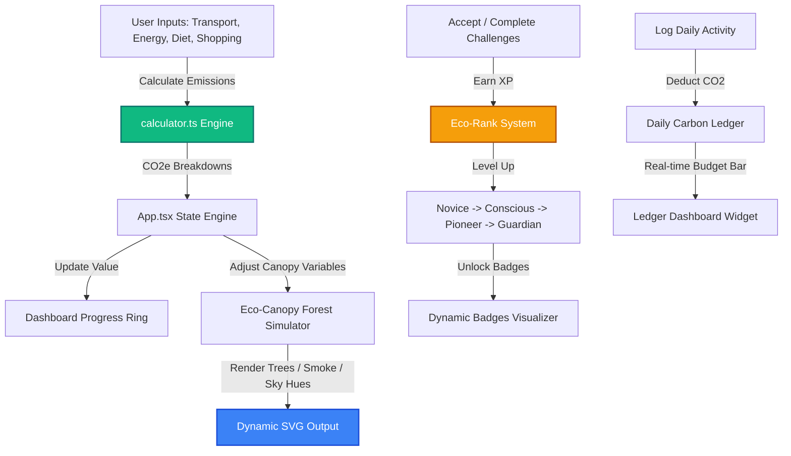

# 🌲 TerraTrace — Carbon Footprint Tracker & Reduction Guide

> An interactive, premium web application designed to help individuals understand, track, and reduce their carbon footprint through gamified logs, visual ecosystems, and personalized reduction suggestions.

---

## 🚀 Live App Deployment

TerraTrace is fully containerized and hosted on Google Cloud Run:
* **Live App URL:** [https://carbon-tracker-423239228514.us-central1.run.app](https://carbon-tracker-423239228514.us-central1.run.app)
* **Hosting Platform:** Google Cloud Run (us-central1)
* **Build Automation:** Google Cloud Build + Artifact Registry

---

## 🎨 Premium Visual Features

TerraTrace goes beyond simple calculators by introducing immersive, gamified features:

1. **🌳 Eco-Canopy Forest Simulator:** A real-time vector SVG environment representing your environmental footprint. 
   * Low footprints generate a lush, green pine canopy.
   * High footprints cause acid-smog skies, withered tree trunks, and industrial smoke layers.
2. **🏆 Eco-Rank Leveling & Badges:** Earn XP by accepting and completing sustainability challenges. Level up from **Eco Novice** up to **Climate Guardian** to unlock custom badges.
3. **📊 Daily Carbon Ledger:** Log small everyday tasks (bus trips, diet choices, recycling) to track daily carbon emissions against a set **5.4 kg CO2e limit** (sustainable target).

---

## 🔮 System Architecture & Logic Flow

Below is the flowchart representing how carbon data flows through the application state, affecting the visual forest simulation and rank leveling:



---

## ☁️ Google Cloud Deployment Pipeline

TerraTrace uses a modern CI/CD flow utilizing Google Cloud Build to compile, containerize, and deploy the application. Here is the process:

```mermaid
graph LR
    LocalCode[Vite React Codebase] -->|gcloud builds submit| CloudBuild[Google Cloud Build]
    CloudBuild -->|Multi-stage Dockerfile Build| NodeCompiler[1. Node Compile dist/]
    NodeCompiler -->|Copy Assets| NginxServer[2. Nginx Image]
    NginxServer -->|Push Container Image| ArtifactRegistry[Artifact Registry]
    ArtifactRegistry -->|Deploy Revision| CloudRun[Google Cloud Run]
    CloudRun -->|Serve Static SPA over HTTPS| EndUser[End User Web App]

    style CloudBuild fill:#2563eb,stroke:#1d4ed8,color:#fff
    style ArtifactRegistry fill:#65a30d,stroke:#4d7c0f,color:#fff
    style CloudRun fill:#0284c7,stroke:#0369a1,color:#fff
```



---

## 🛠️ Technology Stack

* **Frontend Framework:** React 18 (TypeScript)
* **Build Tooling:** Vite
* **Styling System:** Custom Vanilla CSS (HSL dark mode theme + Glassmorphic components)
* **Icons:** Lucide React
* **Hosting / Serving:** Nginx inside a Docker Alpine container
* **Cloud Infrastructure:** Google Cloud Platform (GCP)

---

## 💻 Quick Start & Setup

### Local Mockup Testing
If you want to test the interactive mockup instantly in any web browser without Node/npm compilation:
1. Open the [demo.html](file:///c:/Users/HP/javed pro/demo.html) file directly in your browser.

### Development Compilation
To build and compile the React application locally (requires Node.js):
1. Install dependencies:
   ```bash
   npm install
   ```
2. Start the local Vite development server:
   ```bash
   npm run dev
   ```
3. Create the production bundle:
   ```bash
   npm run build
   ```

---

## 🛳️ Deploy to Google Cloud Run

To update or redeploy your build to Google Cloud:

1. **Log in to Google Cloud SDK:**
   ```bash
   gcloud auth login
   ```
2. **Set target project ID:**
   ```bash
   gcloud config set project javed-499516
   ```
3. **Submit the Cloud Build pipeline:**
   ```bash
   gcloud builds submit --config cloudbuild.yaml
   ```
4. Access the printed revision endpoint once the build succeeds!
